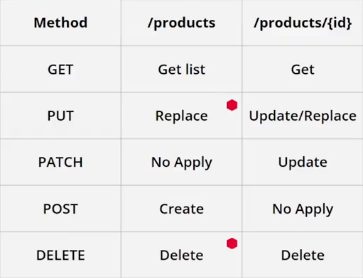

# my-store
Express course
Learning Express to build applications with Node.js.

# Express
Express is a minimal and flexible Node.js web application framework that provides a robust set of features for web and mobile applications.

## Installation

  npm install express --save

## Routing
Defining the differets routes/sections of the application.

## JSON
Using this format to send data to the client.

## API RESTful ( Representational State Transfer ) 
It's a convention that we use to comunicate services by HTTP protocols.

## Database
The data in this app is built with Postgresql, using Sequelize to define its structure and perform its variety of queries, facilitating its updating, maintenance and implementation of new data. All this running in a container in Docker.

 

## Authentication and Authorization
On the authentication side, Passport is used to verify users are in the system and can verify their identity. Finally for the authorization, JWT is used to verify the permissions of each user, all this at the hand of Passport and its different strategies.

 

